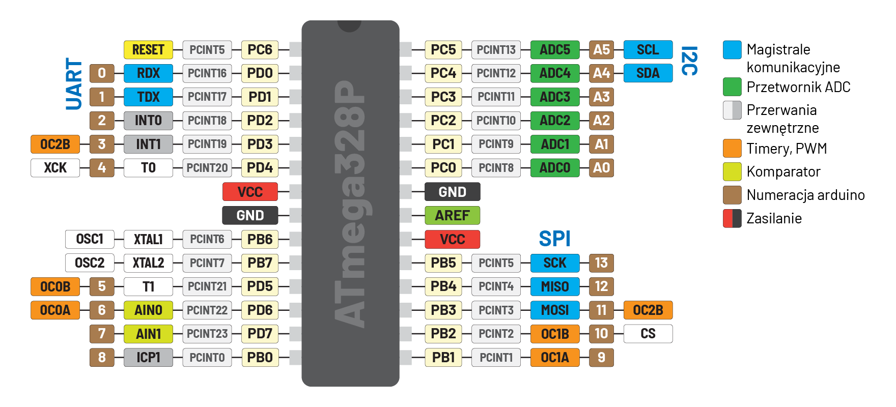
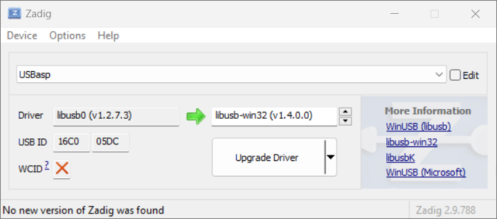

# 🎓 AVR

Kurs programowania procesorów **AVR** na przykładzie mikrokontrolera **Atmega328P**.

## 🤔 Dlaczego AVR?

Mikrokontrolery wydane przez firmę Atmel nie są już aż tak popularne jak kiedyś i są powolutku wypierane. Jednak w mojej opinii taka Atmega jest lepszym procesorem na początek samodzielnej nauki niż zaawansowany STM32.

- Mamy ją w obudowie **DIP28** THT, więc możemy sobie na płytce stykowej wszystko sami poogarniać
- W sieci i literaturze można znaleźć masę przykładów i materiałów dotyczących tych mikrokontrolerów, z których zdecydowana większość dotyczy scalaków Atmega8A, Atmega32A oraz **Atmega328P**
- W bardziej zaawansowanych konstrukcjach, jak STM32, przykłady i kursy często opierają się na warstwie abstrakcji i gotowych bibliotekach, co pozwala szybko osiągnąć efekt, ale jednocześnie zniechęca do zrozumienia faktycznego działania układu i sterowania poprzez rejestry, co w rezultacie utrudnia budowanie solidnych fundamentów wiedzy.
- [Datasheet Atmega328P](assets/atmega328p-datasheet.pdf) ma **200 stron**, więc poznanie całej architektury zajmie relatywnie mało czasu. To pozwala szybciej przyswajać nowe architektury. Peryferia są te same, tylko bardziej rozbudowane.
- Mała różnorodność wykorzystywanych peryferiów i ich prostota, która w rozwiązaniach rynkowych jest dużym ograniczeniem, tutaj przekłada się na spójność przykładów. Jeden UART, niewielkie możliwości konfiguracji - wystarczy podłączyć i działa.
- Układ ATmega328P jest na tyle prosty i popularny, że:
  - **Emulatory** są dobrze dopracowane i można pracować bez sprzętu, a kod przenieść później na mikrokontroler
  - **Modele językowe** generują niemal bezbłędny kod.



## 📦 Co potrzebujemy?

- Płytkę ze wbudowanym bootloaderem, na przykład Arduino, lub bez ale wówczas potrzebujemy zewnętrzny programator USBasp.
- Kopilator języka C przygotowany specjalnie pod mikrokontrolery AVR jakim jest **WinAVR**. Po [pobraniu](https://sqrt.pl/WinAVR.zip)/[instalacji](https://winavr.sourceforge.net/download.html) najlepiej umieścić go w lokalizacjai `C:\WinAVR`.
- [Klient **GIT**](https://git-scm.com/download/win), który rozwiąże kwestie tworzenia nowego/czystego projektu z szablonu, który stanowi zawartość tego repozytorium.
- Edytor kodu **IDE**, tak jak [**VSCode**](https://code.visualstudio.com/). Chociaż formalnie można obejść się bez niego, to narzędzie bywa niezmiernie pomocne. Wyłapuje większość błędów, koloruje składnię oraz podpowiada podczas tworzenia kodu.
- Narzędzia do zarządzania procesem kompilacji programów, jakim jest [**Make**](https://www.gnu.org/software/make/). Aby zainstalować **Make**, można skorzystać z wbudowanego menedżera pakietów [**winget**](https://learn.microsoft.com/en-us/windows/package-manager/winget/). Wystarczy otworzyć konsolę i wywołać komendę:

```
winget source update
winget install -e --id GnuWin32.Make
```

W przypadku problemów z instalacją przez **winget**, aplikację **Make** można [pobrać bezpośrednio](https://sqrt.pl/Make.zip). Następnie jej zawartość można umieścić w folderze `C:\Make`.

Instalacja **Make** za pomocą **winget** umieszcza pliki w lokalizacji `C:\Program Files (x86)\GnuWin32\bin`. W pozostałych przypadkach należy ręcznie dodać ścieżkę do zmiennej systemowej `Path`. _Nie tworzymy nowej zmiennej systemowej ani nie nadpisujemy istniejących wpisów!_

🪟 `Win` + `R` » `sysdm.cpl` » Advanced » **Environment Variables**

- 🖱️`Path` » 🆕`C:\WinAVR\bin`
- 🖱️`Path` » 🆕`C:\Make\bin`

Na zakończenie należy otworzyć konsolę i zweryfikować, czy wszystkie pakiety zostały zainstalowane poprawnie. Można to zrobić przy użyciu komendy `--version`.
```sh
avr-gcc --version
avr-objcopy --version
avrdude -v
make --version
```

Korzystając z **USBAsp**, należy zainstalować odpowiedni sterownik dla systemu Windows. Można to zrobić za pomocą [programu **Zadig**](https://zadig.akeo.ie/). Z listy urządzeń wybierz USBAsp. Jeśli urządzenie nie jest widoczne, wejdź w **_Options_** i zaznacz **_List All Devices_**. Następnie wybierz USBAsp, wybierz sterownik `libusb-win32` i zainstaluj go klikając **Upgrade Driver**:



## 🔥 Compile and burn

Aby sklonować repozytorium, a tym samym utworzyć nowy projekt AVR, wystarczy _(o ile mamy zainstalowanego [klienta Git](https://git-scm.com/download/win))_ wykonać następującą komendę `clone`:

```sh
git clone https://github.com/Xaeian/AVR
```

Pierwszym etapem uruchamiania programu jest przekształcenie naszego projektu w języku **C**, czyli w tym przypadku pliku `main.c`, w plik wsadowy _(program)_ dla mikrokontrolera w formacie `.hex` _(lub `.bin`)_. Proces ten nazywamy **kompilacją**:

```sh
avr-gcc -Os -DF_CPU=16000000UL -D__AVR_ATmega328P__ -mmcu=atmega328p -c -o main.o main.c
avr-gcc -mmcu=atmega328p main.o -o main.elf
avr-objcopy -O ihex -R .eeprom main.elf main.hex
```

Następnie należy zaprogramować mikrokontroler, czyli wgrać plik wsadowy do jego pamięci. Dokładniej mówiąc, musimy wgrać nasz plik `.hex` do dedykowanego sektoru pamięci FLASH mikrokontrolera. Komenda ta będzie różniła się w zależności od programatora. Pracując z **Arduino** lub inną płytką z bootloaderem _(gdzie należy zwrócić uwagę na **port COM**, który system przydzielił naszemu urządzeniu)_, komenda `avrdude` będzie wyglądać następująco:

```sh
avrdude -F -V -c arduino -P COM3 -b 115200 -p ATMEGA328P -U flash:w:main.hex
```

W przypadku **USBasp** komenta `avrdude` będzie wyglądać tak:

```sh
avrdude -c usbasp -p ATMEGA328P -U flash:w:main.hex
```

Proces ten już teraz wydaje się skomplikowany, a stanie się jeszcze bardziej uciążliwy wraz z rozwojem projektu i wzrostem liczby plików. Aby go zautomatyzować, użyjemy narzędzia `make`, które dzięki konfiguracji zawartej w pliku `makefile` zrobi wszystko automatycznie. Wystarczy wpisać w konsoli:

```sh
make
```

Jednorazowo trzeba umieścić listę plików `.c` w zmiennej `SRC` oraz listę folderów z plikami nagłówkowymi `.h` w zmiennej `INC`. Trzeba zwrócić uwagę na ustawienie **16MHz**: `-DF_CPU=16000000UL`, które informuje kompilator, z jaką częstotliwością pracuje nasz mikrokontroler. To ustawienie jest kompatybilne z płytkami Arduino, które są wyposażone w taki właśnie oscylator kwarcowy. Jednak po zakupie nowych mikrokontrolerów **ATmega328P** domyślnie pracują one z częstotliwością `1MHz`, korzystając z wewnętrznego oscylatora RC. Warto zmienić ich ustawienia na pracę z zewnętrznym rezonatorem kwarcowym albo wyłączyć preskaler, co zwiększy częstotliwość wewnętrznego oscylatora do `8MHz`. Można to zrobić za pomocą programu `avrdude`:

```bash
# External crystal resonator
avrdude -c usbasp -p m328p -U lfuse:w:0xFF:m -U hfuse:w:0xD9:m -U efuse:w:0xFF:m
# Internal RC oscillator
avrdude -c usbasp -p m328p -U lfuse:w:0xE2:m -U hfuse:w:0xD9:m -U efuse:w:0xFF:m
```

Pamiętaj, aby zmienić definicję częstotliwości `F_CPU` w pliku `makefile`, jeśli jest inna niż **16MHz**. W przeciwnym razie funkcja `_delay_ms()` oraz inne funkcje czasowe wykorzystujące tę definicję będą niepoprawnie odmierzać czas ⌛.
